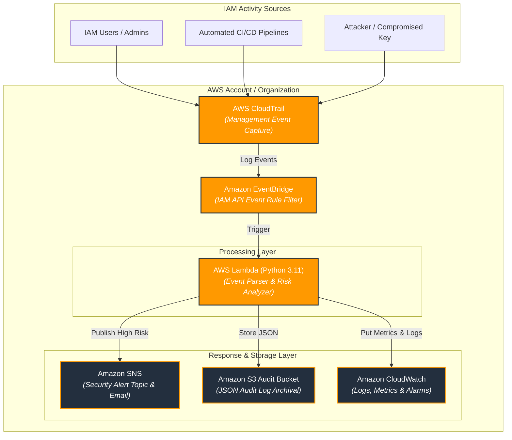

# Architecture

- [Architecture](#architecture)
  - [System Data Flow](#system-data-flow)
  - [AWS Services & Responsibilities](#aws-services-%26-responsibilities)
  - [Deployment Ordering](#deployment-ordering)
  - [Terraform vs. Bash](#terraform-vs-bash)

This architecture is provisioned identically by both implementations, see
[USAGE.md](USAGE.md) to deploy it via either [`project/bash/`](project/bash/README.md)
(imperative) or [`project/terraform/`](project/terraform/README.md) (declarative).

## System Data Flow

The architecture follows an event-driven serverless pattern:

## AWS Services & Responsibilities

| AWS Service            | Purpose                                                                                                                             |
| :--------------------- | :---------------------------------------------------------------------------------------------------------------------------------- |
| **AWS IAM**            | Customer-managed policies, groups, users, execution roles, and trust policies.                                                      |
| **AWS CloudTrail**     | Captures AWS account management events and API calls across the account.                                                            |
| **Amazon EventBridge** | Evaluates CloudTrail events against IAM pattern filters and invokes Lambda.                                                         |
| **AWS Lambda**         | Python 3.11 handler: source IP validation, risk classification, S3 audit logging, SNS alert publishing, CloudWatch metric emission. |
| **Amazon SNS**         | Topic, topic policy, and email subscription management for security alerts.                                                         |
| **Amazon S3**          | Server-side encrypted (AES-256), versioned storage for CloudTrail logs and historical IAM audit records.                            |
| **Amazon CloudWatch**  | Log group retention management, custom metrics (`AWSIAMMonitor`), and alarms.                                                       |

## Deployment Ordering

The Bash implementation provisions this architecture as an explicit 5-stage
sequence (`./awsctl --up all`); the Terraform implementation resolves the
same ordering automatically from its module dependency graph
(`terraform apply`), both converge on the same end state.

1. **IAM**: Customer-managed policies (`DevPolicy`, `ProdPolicy`, `AuditPolicy`), groups, users, and optional execution roles.
2. **CloudTrail**: S3 log bucket and CloudTrail management events trail.
3. **SNS**: Alert topic (`iam-alerts`), topic policy, and email subscription.
4. **Lambda**: S3 audit history bucket, execution role, packaged `lambda_function.py`, and CloudWatch log group.
5. **EventBridge**: Rule pattern registration, Lambda target attachment, and invocation permission.

Teardown (`./awsctl --down all` / `terraform destroy`) reverses this order.

## Terraform vs. Bash

Both implementations provision the same architecture and diagram above, they
are independent, equivalent implementations, not a sequential pipeline vs. a
declarative one being functionally different. Terraform additionally
provisions optional CloudWatch alarms on the metrics Lambda already emits
(`UnauthorizedIPAccess` and function `Errors`), which is a Terraform-only
enhancement, not a divergence in required behavior.

> [!NOTE]
> See [Terraform - README.md](project/terraform/README.md#differences-from-the-bash-implementation) for the complete comparison.
