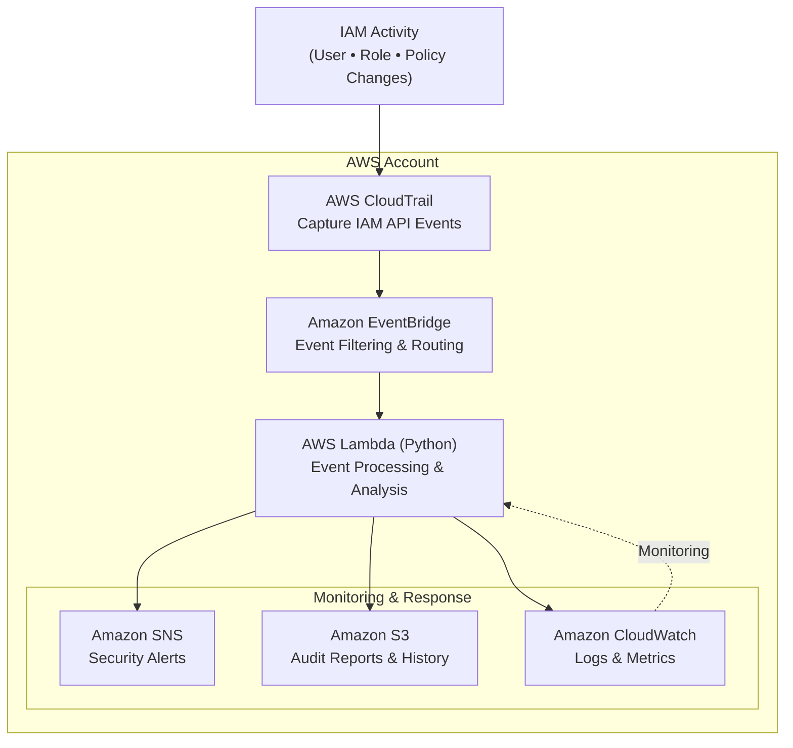
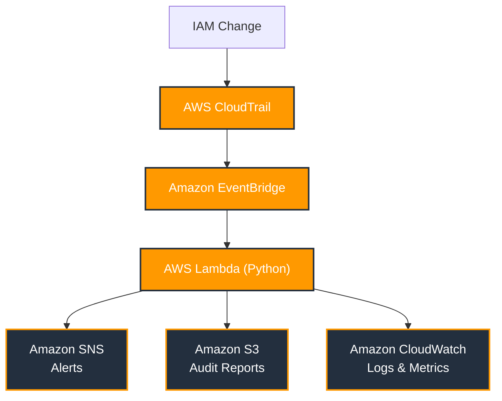

[](https://github/ZouariOmar/aws-iam-monitor/graphs/contributors)
[](https://github/ZouariOmar/aws-iam-monitor/network/members)
[](https://github.com/github/ZouariOmar/aws-iam-monitor/stargazers)
[](https://github/ZouariOmar/aws-iam-monitor/issues)
[](https://raw.githubusercontent.com/ZouariOmar/aws-iam-monitor/refs/heads/main/LICENSE)
[](https://www.linkedin.com/in/zouari-omar)

<div align="center">


<h1>aws-iam-monitor</h1>

<h6>Monitor, Audit, Protect, Real-time visibility into AWS IAM changes and access control activity</h6>


</div>

- [Overview](#overview)
- [Project Flow](#project-flow)
- [Key Features](#key-features)
  - [Real-time Detection](#real-time-detection)
  - [Existing System Audit](#existing-system-audit)
  - [Permission Tracking](#permission-tracking)
  - [IP Whitelists and Conditions](#ip-whitelists-and-conditions)
  - [Centralized Alerts](#centralized-alerts)
  - [Reports and History](#reports-and-history)
- [Usage](#usage)
- [Download](#download)
- [Emailware](#emailware)
- [Contributing](#contributing)
- [License](#license)
- [Contact](#contact)

<div align="center">


</div>

## Overview

aws-iam-monitor is a real-time AWS IAM auditing and monitoring platform designed
to provide continuous visibility into identity and access management activities
across AWS environments.

The system monitors IAM changes, analyzes **AWS CloudTrail** events, and detects
security-sensitive modifications such as new user creation, permission
changes, role updates, and access policy modifications. By centralizing IAM
activity monitoring, organizations can quickly identify unauthorized changes,
improve security posture, and maintain compliance with cloud governance requirements.

aws-iam-monitor helps security teams understand **who changed what, when, and
from where**, while maintaining a complete historical record of IAM activity
for investigation and auditing purposes.

> [!NOTE]
> The architecture is designed to support **AWS Organizations**.

> [!IMPORTANT]
> In a production deployment, the monitoring Lambda would assume a **read-only IAM**
> role in each member account using AWS STS AssumeRole, enabling centralized IAM
> auditing across the organization.

## Project Flow





## Key Features

### Real-time Detection

Automatically detect IAM changes as they occur, including the creation of
new IAM users, roles, access keys, and other identity-related resources.

### Existing System Audit

Perform comprehensive IAM inventory scans across AWS accounts to identify
existing users, roles, policies, and permissions.

### Permission Tracking

Monitor and analyze changes to IAM roles, policies, and permission boundaries to
detect privilege escalation risks and unauthorized access modifications.

### IP Whitelists and Conditions

Track changes to IAM policy conditions, source IP restrictions, and
network-based access controls to identify unexpected changes in access rules.

### Centralized Alerts

Aggregate IAM security events at the AWS Organization level and deliver
centralized alerts for faster detection and response.

### Reports and History

Generate detailed audit reports and maintain historical IAM activity records for
compliance reviews, security investigations, and forensic analysis.

## Usage

```bash
git clone https://github/ZouariOmar/aws-iam-monitor
cd aws-iam-monitor

make
```

> See [INSTALL.md](/INSTALL.md) for more informations

## Download

You can [download](https://github.com/ZouariOmar/aws-iam-monitor/releases) the latest installable version of aws-iam-monitor for Windows, macOS and Linux.

## Emailware

aws-iam-monitor is an emailware. Meaning, if you liked using this app or it has helped you in any way,
would like you send as an email at <zouariomar20@gmail.com> about anything you'd want to say about
this software. I'd really appreciate it!

## Contributing

Contributions are welcome! Please feel free to submit a Pull Request.

## License

This repository is licensed under the **Apache-2.0**. You are free to use, modify, and distribute the content. See the [LICENSE](LICENSE) file for details.

## Contact

For questions or suggestions, feel free to reach out:

- **github**: [github](https://github/ZouariOmar/aws-iam-monitor)
- **Email**: <zouariomar20@gmail.com>
- **LinkedIn**: [zouari-omar](https://www.linkedin.com/in/zouari-omar)
