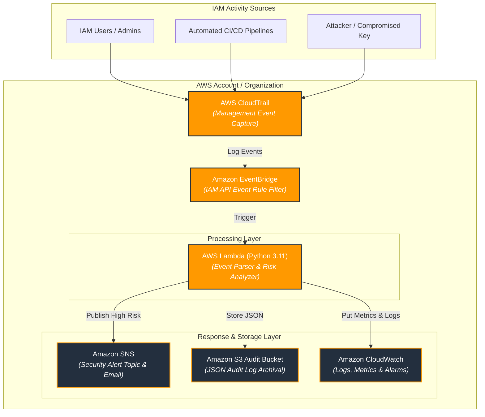

<div align="center">


<h1>aws-iam-monitor</h1>

<p><strong>Enterprise-grade, real-time AWS IAM auditing, security monitoring, and automated threat detection platform.</strong></p>

[](https://github.com/ZouariOmar/aws-iam-monitor/graphs/contributors)
[](https://github.com/ZouariOmar/aws-iam-monitor)
[](https://github.com/ZouariOmar/aws-iam-monitor)
[](https://github.com/ZouariOmar/aws-iam-monitor/releases)
[](LICENSE)
[](https://www.gnu.org/software/bash/)
[](https://www.python.org/)
[](https://aws.amazon.com/)

</div>

## Overview

**aws-iam-monitor** is a production-ready, serverless AWS security solution designed to provide continuous, real-time visibility into Identity and Access Management (IAM) changes across AWS accounts and AWS Organizations.

By capturing management events from **AWS CloudTrail**, filtering events with **Amazon EventBridge**, and processing security payloads with **AWS Lambda**, the system detects unauthorized modifications, privilege escalation risks, new credential creation, and policy tampering within seconds. High-risk events immediately trigger **Amazon SNS** notifications (with optional automated email subscriptions) while maintaining structured audit logs in **Amazon S3** and custom performance metrics in **Amazon CloudWatch**.

```
IAM Action ──► CloudTrail ──► EventBridge ──► Lambda ──► SNS Alerts (Email)
                                                      ├─► S3 Audit Logs
                                                      └─► CloudWatch Metrics
```

## Key Features

- **Real-time Event Detection**: Instant detection of sensitive IAM operations (e.g. `CreateUser`, `DeletePolicy`, `CreateAccessKey`, `DeactivateMFADevice`, `AttachUserPolicy`).
- **IP Whitelisting & Enforcement**: Automated generation of `IPWhitelistPolicy` and real-time source IP validation within the monitoring Lambda.
- **Risk Classification**: Automated risk grading (`CRITICAL`, `HIGH`, `MEDIUM`, `LOW`) for every IAM API call.
- **Dedicated SNS Management Component**: Dedicated `sns` module with automated email alert subscriptions via `.env` or CLI parameters.
- **Audit Trail Archiving**: Every IAM event is saved as a structured JSON record in Amazon S3 grouped by date (`YYYY/MM/DD/`).
- **CloudWatch Metrics**: Emits custom `AWSIAMMonitor` metrics for CloudWatch dashboards and alarm creation.
- **Idempotent Infrastructure**: CLI tooling (`awsctl`) creates, updates, and deletes resources safely without duplicate creation.
- **Zero External Dependencies**: Operates purely using standard Bash, Python 3, and official AWS CLI v2 without runtime third-party dependencies.

## Architecture Flow


```mermaid
flowchart TD
    subgraph IAM_Events["IAM Activity Sources"]
        A1["IAM Users / Admins"]
        A2["Automated CI/CD Pipelines"]
        A3["Attacker / Compromised Key"]
    end

    subgraph AWS_Account["AWS Account / Organization"]
        B["AWS CloudTrail<br/><i>(Management Event Capture)</i>"]
        C["Amazon EventBridge<br/><i>(IAM API Event Rule Filter)</i>"]

        subgraph Serverless_Processing["Processing Layer"]
            D["AWS Lambda (Python 3.11)<br/><i>(Event Parser & Risk Analyzer)</i>"]
        end

        subgraph Output_Layer["Response & Storage Layer"]
            E["Amazon SNS<br/><i>(Security Alert Topic & Email)</i>"]
            F["Amazon S3 Audit Bucket<br/><i>(JSON Audit Log Archival)</i>"]
            G["Amazon CloudWatch<br/><i>(Logs, Metrics & Alarms)</i>"]
        end
    end

    A1 --> B
    A2 --> B
    A3 --> B

    B -->|Log Events| C
    C -->|Trigger| D

    D -->|Publish High Risk| E
    D -->|Store JSON| F
    D -->|Put Metrics & Logs| G

    classDef aws fill:#FF9900,color:#fff,stroke:#232F3E,stroke-width:2px;
    classDef service fill:#232F3E,color:#fff,stroke:#FF9900,stroke-width:2px;
    class B,C,D aws;
    class E,F,G service;
```

## AWS Services Used

| AWS Service            | Purpose                                                                             |
| :--------------------- | :---------------------------------------------------------------------------------- |
| **AWS IAM**            | Customer-managed policies, groups, users, execution roles, and trust policies.      |
| **AWS CloudTrail**     | Captures AWS account management events and API calls.                               |
| **Amazon SNS**         | Topic, topic policy, and email subscription management for security alerts.         |
| **AWS Lambda**         | Python-based event evaluation, risk scoring, S3 logging, SNS alert dispatching.     |
| **Amazon EventBridge** | Filters IAM API call patterns from CloudTrail and targets Lambda.                   |
| **Amazon S3**          | Server-side encrypted storage for CloudTrail logs and historical IAM audit records. |
| **Amazon CloudWatch**  | Log Group retention management, metric emission, and alarm monitoring.              |

## Repository Structure

```
aws-iam-monitor/
├── Makefile
├── README.md
├── project/
│   ├── .env                        # Environment configuration
│   ├── .env.example                # Environment configuration template
│   ├── awsctl                      # Primary orchestration CLI binary
│   ├── lib/                        # Shared helper library
│   ├── iam/                        # IAM module
│   ├── cloud-trail/                # CloudTrail module
│   ├── sns/                        # SNS module
│   ├── event-bridge/               # EventBridge module
│   └── lambda/                     # Lambda module
└── res/                            # Documentation assets & logos
```

## Prerequisites & Installation

### Requirements

- **Operating System**: Linux / macOS
- **Shell**: Bash v5.0+
- **Tools**:
  - `aws-cli` (v2.0+)
  - `jq` (v1.6+)
  - `sed` (v4.10+)
  - `zip` (v3.0+)
  - `openssl` (v3.6+)
  - `python3` (v3.11+)

### Installation & Configuration

```bash
# Clone the repository
git clone https://github.com/ZouariOmar/aws-iam-monitor.git
cd aws-iam-monitor/project

# Configure environment variables (optional: set SNS email alert recipient)
cp .env.example .env
nano .env  # Set SNS_ALERT_EMAIL=security-team@example.com, ALLOWED_IPS=1.2.3.4/32,5.6.7.8/24

# Ensure CLI executable permissions
chmod +x awsctl \
  lib/* \
  iam/src/* \
  cloud-trail/src/* \
  sns/src/* \
  sns/test/* \
  event-bridge/src/* \
  lambda/src/* \
  event-bridge/test/* \
  lambda/test/*

# Verify AWS CLI authentication
aws sts get-caller-identity
```

## CLI Usage (`awsctl`)

The primary orchestration tool is `./awsctl`. It provides a unified command line interface for provisioning, managing, testing, and destroying infrastructure components.

### Command Syntax

```bash
./awsctl <ACTION> [TARGET] [OPTIONS]
```

#### Actions

- `--up` : Create/configure resources.
- `--down` : Tear down/delete resources.
- `--status` : Check status of resources.
- `--test` : Execute test suites.

#### Targets

- `all` _(default)_ : Complete monitoring infrastructure.
- `iam` : IAM policies, groups, users, and roles.
- `cloud-trail` : CloudTrail trail and log S3 bucket.
- `sns` : SNS security alert topic and email subscriptions.
- `lambda` : Lambda function and audit S3 bucket.
- `event-bridge` : EventBridge rule and target registration.

#### Options

- `-r`, `--role` : Include optional IAM roles during IAM setup.
- `-v`, `--verbose` : Display detailed AWS CLI execution logs.
- `-h`, `--help` : Show help message.

## Deployment Examples

### 1. Provision Complete Monitoring Environment

```bash
./awsctl --up all
```

_This will automatically:_

1. Create customer-managed IAM policies (`DevPolicy`, `ProdPolicy`, `AuditPolicy`), groups (`DevGroup`, `ProdGroup`, `TestGroup`), and users (`DevAdmin`, `ProdAdmin`, etc.).
2. Provision an S3 log bucket and create a CloudTrail management events trail.
3. Provision the SNS alert topic (`iam-alerts`) and subscribe `SNS_ALERT_EMAIL` if configured in `.env`.
4. Provision an S3 audit history bucket and deploy the monitoring Lambda function with its execution role.
5. Create an EventBridge rule for IAM events, attach the Lambda function as a target, and grant invocation permissions.

### 2. Provision SNS Alert Component Only

```bash
./awsctl --up sns
```

### 3. Check System Status

```bash
./awsctl --status all
```

### 4. Run Automated Test Suite

```bash
./awsctl --test all
```

### 5. Tear Down Infrastructure

```bash
./awsctl --down all
```

## Security Considerations

- **Least Privilege Access**: All IAM execution policies are scoped strictly to necessary permissions.
- **Data Protection**: S3 log buckets enforce AES-256 Server-Side Encryption (SSE) and S3 versioning.
- **Zero Hardcoded Credentials**: No AWS access keys or secrets are stored in code or configuration files. Credentials are read directly from the environment or AWS CLI profile.
- **Idempotency**: Resources are safely checked before creation or deletion to prevent unintended service disruptions.

## License

This project is licensed under the **Apache-2.0 License**. See the [LICENSE](LICENSE) file for details.

## Contact & Support

- **Author**: [@ZouariOmar](https://github.com/ZouariOmar)
- **Email**: <zouariomar20@gmail.com>
- **LinkedIn**: [zouari-omar](https://www.linkedin.com/in/zouari-omar)
- **Issues**: [GitHub Issues](https://github.com/ZouariOmar/aws-iam-monitor/issues)
