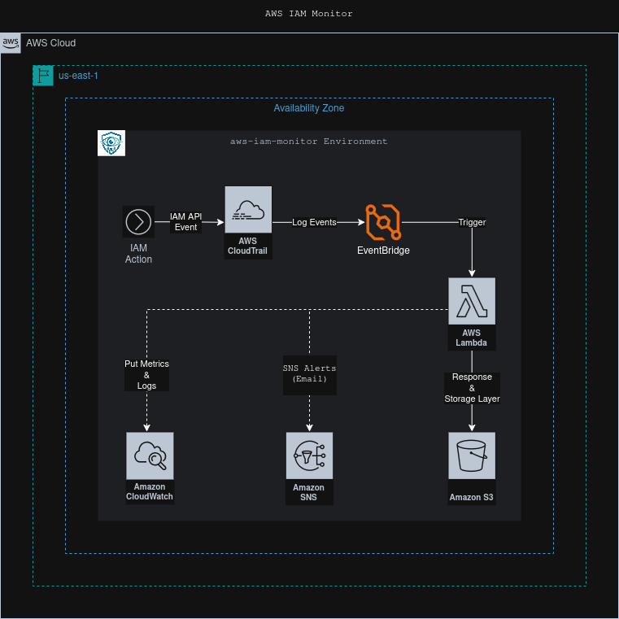

<div align="center">


<h1>aws-iam-monitor</h1>

<p><strong>Enterprise-grade, real-time AWS IAM auditing, security monitoring, and automated threat detection platform.</strong></p>

[](https://github.com/ZouariOmar/aws-iam-monitor/graphs/contributors)
[](https://github.com/ZouariOmar/aws-iam-monitor)
[](https://github.com/ZouariOmar/aws-iam-monitor)
[](https://github.com/ZouariOmar/aws-iam-monitor/releases)
[](LICENSE)
[](https://www.gnu.org/software/bash/)
[](https://www.python.org/)
[](https://www.terraform.io/)
[](https://aws.amazon.com/)

</div>

- [Overview](#overview)
- [Key Features](#key-features)
- [Documentation](#documentation)
- [Repository Structure](#repository-structure)
- [Quickstart](#quickstart)
  - [Clone project](#clone-project)
  - [With Bash](#with-bash)
  - [With Terraform](#with-terraform)
- [License](#license)
- [Contact & Support](#contact--support)

<div align="center">

</div>

## Overview

**aws-iam-monitor** is a production-ready, serverless AWS security solution designed to provide continuous, real-time visibility into Identity and Access Management (IAM) changes across AWS accounts and AWS Organizations.

By capturing management events from **AWS CloudTrail**, filtering events with **Amazon EventBridge**, and processing security payloads with **AWS Lambda**, the system detects unauthorized modifications, privilege escalation risks, new credential creation, and policy tampering within seconds. High-risk events immediately trigger **Amazon SNS** notifications (with optional automated email subscriptions) while maintaining structured audit logs in **Amazon S3** and custom performance metrics in **Amazon CloudWatch**.

<div align="center">

</div>

## Key Features

- **Real-time Event Detection**: Instant detection of sensitive IAM operations (e.g. `CreateUser`, `DeletePolicy`, `CreateAccessKey`, `DeactivateMFADevice`, `AttachUserPolicy`).
- **IP Whitelisting & Enforcement**: Automated generation of `IPWhitelistPolicy` and real-time source IP validation within the monitoring Lambda.
- **Risk Classification**: Automated risk grading (`CRITICAL`, `HIGH`, `MEDIUM`, `LOW`) for every IAM API call.
- **Dedicated SNS Management Component**: Dedicated `sns` module with automated email alert subscriptions via `.env` or CLI parameters.
- **Audit Trail Archiving**: Every IAM event is saved as a structured JSON record in Amazon S3 grouped by date (`YYYY/MM/DD/`).
- **CloudWatch Metrics**: Emits custom `AWSIAMMonitor` metrics for CloudWatch dashboards and alarm creation.
- **Idempotent Infrastructure**: Both the Bash CLI (`awsctl`) and the Terraform implementation create, update, and delete resources safely without duplication.
- **Two Equivalent Implementations**: An imperative Bash/AWS-CLI CLI and a declarative Terraform implementation, pick whichever fits your workflow.

## Documentation

| Document                                             | Covers                                                                        |
| :--------------------------------------------------- | :---------------------------------------------------------------------------- |
| [ARCHITECTURE.md](ARCHITECTURE.md)                   | Architecture diagram, AWS services table, deployment ordering                 |
| [INSTALL.md](INSTALL.md)                             | Prerequisites, requirements, and setup for both implementations               |
| [USAGE.md](USAGE.md)                                 | Full Bash (`awsctl`) and Terraform CLI/command reference, deployment examples |
| [SECURITY.md](SECURITY.md)                           | Security policy, vulnerability reporting, security best practices             |
| [SUPPORT.md](SUPPORT.md)                             | Getting help, reporting bugs, feature requests                                |
| [CONTRIBUTING.md](CONTRIBUTING.md)                   | Contribution guidelines                                                       |
| [CHANGELOG.md](CHANGELOG.md)                         | Release history                                                               |
| [Bash - README.md](project/bash/README.md)           | Bash implementation deep reference                                            |
| [Terraform - README.md](project/terraform/README.md) | Terraform implementation deep reference, including differences from Bash      |
| [docapi](/docapi/README.md) (Sphinx site)            | Full documentation site source                                                |

## Repository Structure

```
aws-iam-monitor/
├── Makefile
├── README.md
├── ARCHITECTURE.md
├── INSTALL.md
├── USAGE.md
├── SECURITY.md
├── SUPPORT.md
├── project/
│   ├── bash/                       # Bash / AWS CLI implementation
│   │   ├── .env.example            # Environment configuration template
│   │   ├── awsctl                  # Primary orchestration CLI binary
│   │   ├── lib/                    # Shared helper library
│   │   ├── iam/                    # IAM module
│   │   ├── cloud-trail/            # CloudTrail module
│   │   ├── sns/                    # SNS module
│   │   ├── event-bridge/           # EventBridge module
│   │   ├── lambda/                 # Lambda module
│   │   ├── Makefile                # Bash implementation Makefile
│   │   └── README.md               # Bash implementation reference
│   └── terraform/                  # Terraform implementation
│       ├── main.tf                 # Module wiring
│       ├── variables.tf            # Input variables
│       ├── outputs.tf              # Output values
│       ├── providers.tf            # AWS provider configuration
│       ├── versions.tf             # Terraform & provider version constraints
│       ├── locals.tf               # Computed values
│       ├── terraform.tfvars.example
│       ├── modules/                # iam, cloudtrail, sns, lambda, eventbridge, s3, cloudwatch
│       ├── Makefile                # Terraform implementation Makefile
│       └── README.md               # Terraform implementation reference
└── res/                            # Documentation assets & logos
```

## Quickstart

### Clone project

```bash
git clone https://github.com/ZouariOmar/aws-iam-monitor.git
cd aws-iam-monitor
```

### With Bash

```bash
cp project/bash/.env.example project/bash/.env  # optional: SNS_ALERT_EMAIL, ALLOWED_IPS
make bash-up                                    # Provision infrastructure
```

### With Terraform

```bash
cp project/terraform/terraform.tfvars.example project/terraform/terraform.tfvars
make tf-init
make tf-apply                                   # Provision infrastructure
```

## License

This project is licensed under the **Apache-2.0 License**. See the [LICENSE](LICENSE) file for details.

## Contact & Support

- **Author**: [@ZouariOmar](https://github.com/ZouariOmar)
- **Email**: <zouariomar20@gmail.com>
- **LinkedIn**: [zouari-omar](https://www.linkedin.com/in/zouari-omar)
- **Issues**: [GitHub Issues](https://github.com/ZouariOmar/aws-iam-monitor/issues)
- **Support**: See [SUPPORT.md](SUPPORT.md)
