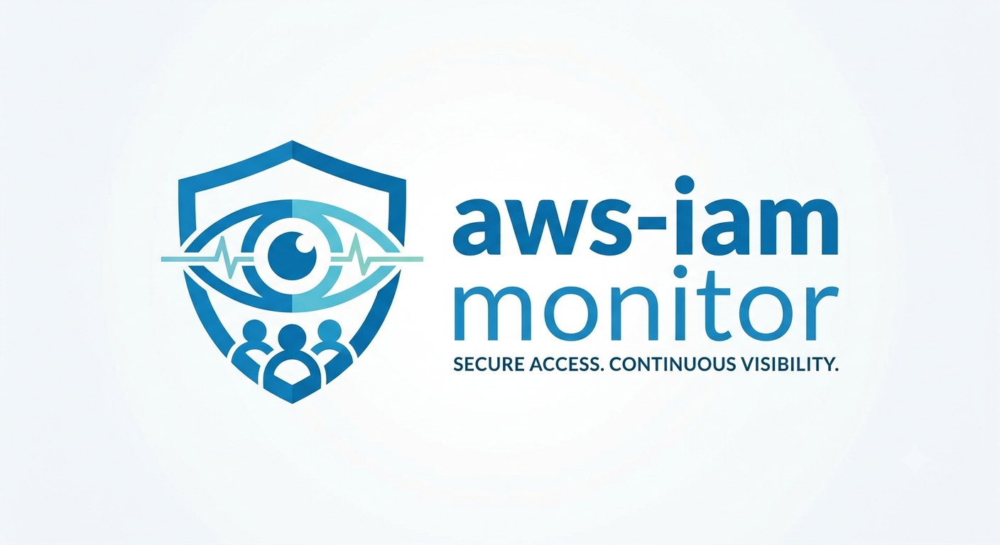

aws-iam-monitor documentation
=============================

.. image:: _static/aws-iam-monitor-logo.png
  :alt: aws-iam-monitor logo
  :align: center
  :width: 300px

Monitor, Audit, Protect
-----------------------

Welcome to the official documentation hub.

**aws-iam-monitor** provides real-time visibility into AWS IAM changes,
detects security-sensitive events, and centralizes auditing across AWS
accounts.

.. note::
  The architecture supports **AWS Organizations**.

.. toctree::
  :maxdepth: 2
  :caption: Getting Started

  getting_started/index
  about/index
  community/index
  project/index

Credits
-------

.. contributors:: ZouariOmar/aws-iam-monitor
  :avatars:

