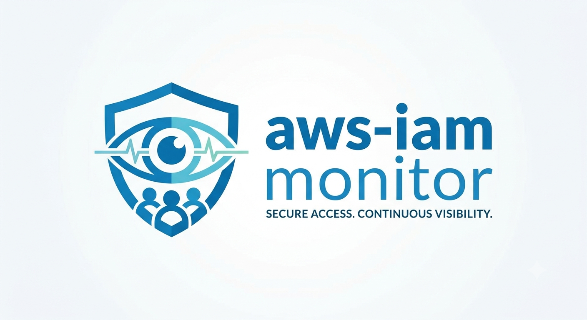

aws-iam-monitor Documentation
=============================

Monitor, Audit, Protect
-----------------------

Welcome to the official documentation hub for **aws-iam-monitor** (v1.0.0).

**aws-iam-monitor** is a production-grade, serverless AWS security solution designed to provide continuous, real-time visibility into Identity and Access Management (IAM) changes across AWS accounts and AWS Organizations.

By capturing management events from **AWS CloudTrail**, filtering events with **Amazon EventBridge**, and processing security payloads with **AWS Lambda**, the system detects unauthorized modifications, privilege escalation risks, new credential creation, and policy tampering within seconds. High-risk events immediately trigger **Amazon SNS** notifications (with automated email subscriptions) while maintaining structured audit logs in **Amazon S3** and custom performance metrics in **Amazon CloudWatch**.

.. note::
  The architecture natively supports multi-account monitoring across **AWS Organizations**.

.. toctree::
  :maxdepth: 2
  :caption: Documentation Navigation

  getting_started/index
  about/index
  community/index
  project/index

Credits
-------

.. contributors:: ZouariOmar/aws-iam-monitor
  :avatars:

